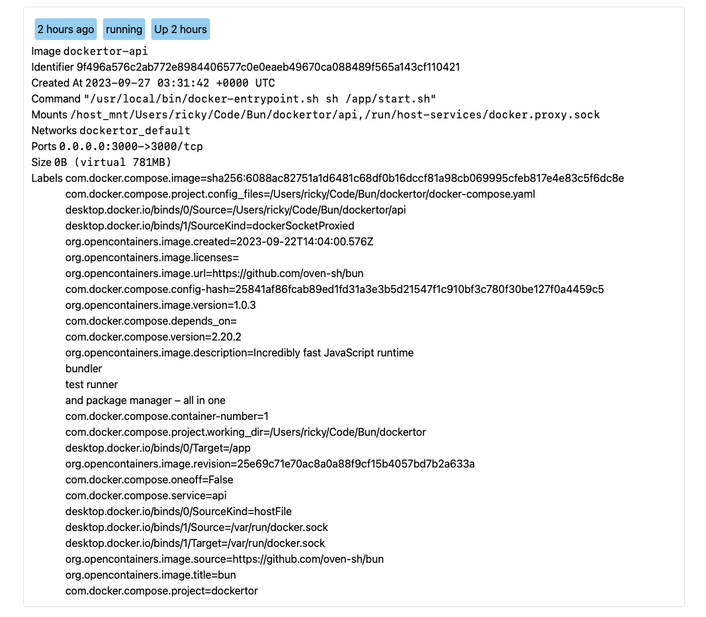

# Dockertor

## Description

Dockertor is a tool that help you inspect your docker containers.
This is an expirimental project to learn how to use bun & Svelte.

## What does it look like



## Usage

```bash
docker compose up
```

## Tech stack

- Bun 1.0.0
- Svelte
- Docker
- tailwindcss
