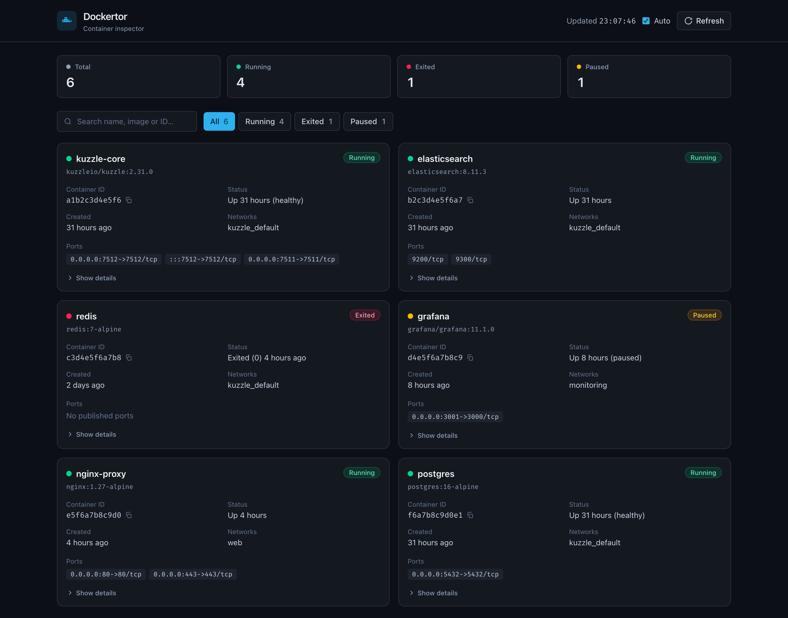

# Dockertor

## Description

Dockertor is a tool that help you inspect your docker containers.
This is an expirimental project to learn how to use bun & Svelte.

## What does it look like



## Usage

```bash
docker compose up
```

Once started:

- Web UI: http://localhost:5173
- API: http://localhost:3000

## Tech stack

- Bun (API server)
- Svelte 5 + SvelteKit 2
- Vite 8
- Tailwind CSS 4
- TypeScript
- Docker

## Container images

Every release publishes two images to GitHub Container Registry:

- `ghcr.io/rolljee/dockertor-api`
- `ghcr.io/rolljee/dockertor-web`

Tagged with the exact version (e.g. `1.2.0`), plus a moving tag: `latest`
for stable releases and `beta` for `develop` pre-releases.

## Branching & releases

The project follows a classic **main / develop** flow with automated releases
driven by [semantic-release](https://semantic-release.gitbook.io/) and
[Conventional Commits](https://www.conventionalcommits.org/).

| Branch    | Purpose                | Result on push                              |
| --------- | ---------------------- | ------------------------------------------- |
| `develop` | Integration branch     | `x.y.z-beta.n` pre-release + `beta` images  |
| `main`    | Stable releases        | `x.y.z` release + `latest` images           |

Workflow:

1. Branch off `develop`, open a PR — **CI** runs type-checks, the web build and
   builds both Docker images (without pushing).
2. Merge into `develop` — a **beta** pre-release is published automatically.
3. Merge `develop` into `main` — the **stable** release is published: version
   bump, `CHANGELOG.md`, git tag, GitHub Release and the versioned images.

Commit messages drive the version bump:

| Type                 | Release |
| -------------------- | ------- |
| `fix: …`             | patch   |
| `feat: …`            | minor   |
| `feat!: …` / `BREAKING CHANGE:` | major |

Preview the next version locally with `npm run release:dry`.

> **Repo setup required:** enable *Read and write permissions* for the
> `GITHUB_TOKEN` (Settings → Actions → General → Workflow permissions), create a
> `develop` branch, and make sure branch protection allows the GitHub Actions
> bot to push the release commit to `main`.
